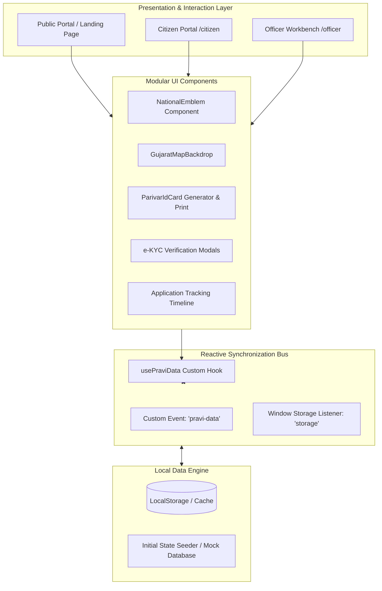

# PRAVI — Parivar ID (પરિવાર ઓળખ સંખ્યા)
### Unified Digital Family Identity & Proactive Welfare Delivery Platform
**Government of Gujarat | ગુજરાત સરકાર**

---

**Author:** Jhil Patel  
**Project Repository:** Final GitHub Submission  
**Live Application Status:** Fully Functional (Citizen & Officer Portals)  
**Target Domain:** e-Governance, Digital India, State Welfare Administration  

---

## 🏛️ 1. Executive Summary & Problem Statement

### 1.1 The Problem
In modern state administration, social welfare schemes (ration/PDS, healthcare, housing, pensions, education scholarships, and agricultural subsidies) operate in **isolated departmental silos**. Each department (Panchayat, Rural Development, Social Justice, Women & Child Development, Food & Civil Supplies) maintains disconnected databases.

This fragmentation causes severe systemic issues:
- **Identity Fragmentation & Repetitive Paperwork:** Citizens must submit the same physical documents (Aadhaar, income certificates, ration cards, caste certificates) repeatedly to multiple offices.
- **Inclusion & Exclusion Errors:** Vulnerable households entitled to benefits often miss them due to lack of information, while ghost or ineligible beneficiaries capture subsidies.
- **Lack of Family-Level Scrutiny:** Welfare eligibility is rarely individual; it is tied to household dynamics (aggregate family income, female head of house, orphan children, senior citizens, landholdings). Individual registries fail to capture this holistic picture.
- **Administrative Delays:** Field officers spend weeks manually verifying paper files and certificates without a unified, real-time single source of truth.

### 1.2 The Solution: PRAVI (પરિવાર ઓળખ સંખ્યા)
**PRAVI** introduces an integrated, citizen-centric digital family registry platform for Gujarat (**"One State · One Family · One ID"**).

- **Unified Household Registry:** Every registered household receives a unique 11-character Parivar ID (e.g., `GJ-2026-00124`), linking the head of family and all dependent members.
- **Aadhaar-Powered Online e-KYC:** Immediate digital validation of household members with simulated OTP verification.
- **Dynamic Cross-Component Profile Sync:** Any status change, member addition, or income update automatically synchronizes across citizen and administrative dashboards in real time.
- **Proactive Entitlement Engine:** Automatically discovers schemes for which a family qualifies based on income thresholds, occupation, and demographics.
- **Officer 360° Workbench:** Enables designated government officers to audit family rosters, review documents, approve/reject applications, and monitor field grievances from a single command interface.
- **Digital Parivar ID Card:** Generates an official, printable identity card with QR code verification and security elements.

---

## 🎨 2. Design System & Gujarat Government Aesthetics

PRAVI is engineered to mirror the visual identity, dignity, and trustworthiness of official Gujarat State portals (such as *Digital Gujarat*, *Gujarat.gov.in*, and *CM Dashboard*):

- **Bilingual Gujarat-First Interface:** Complete UI in Gujarati script (`Noto Sans Gujarati`, `Shruti`) with English subtitles for universal accessibility.
- **State Saffron & Navy Theme:**
  - **Gujarat Saffron Orange (`#ea580c` / `#ff671f`):** Inspires energy, public service, and official authority.
  - **Deep Navy Blue (`#0c2340` / `#07172b`):** Delivers institutional stability, structure, and readability.
  - **Crisp Pure White (`#ffffff`):** Clean, high-contrast readability across cards and forms.
- **State Emblem of India:** Header features the authentic Ashoka Lion Capital emblem with the national motto *"सत्यમેવ જયતે"*.
- **Indian Tricolor Ribbon:** Hallmark top-accent tricolor band (`#ff671f`, `#ffffff`, `#046a38`) running along the portal navigation.
- **Translucent Gujarat Map Backdrop:** A subtle, translucent district map watermark placed in the hero section background to ground the application in Gujarat’s geography without overpowering the content.

---

## 🏗️ 3. System Architecture

The project follows a decoupled, reactive single-page architecture built for fast client-side performance, instant feedback, and straightforward cloud deployment.



### Architectural Highlights
1. **Reactive Event-Driven State Bus (`usePraviData`):**  
   Components subscribe to data updates using a custom hook that listens to both internal `pravi-data` events and cross-tab `storage` events. When an officer approves an application or a citizen verifies a member, all open views update immediately without requiring page reloads.
2. **Deterministic Data Seeding (`src/data.js`):**  
   Initializes demo families, members, documents, applications, and grievances on the first run, preserving user modifications across subsequent sessions.
3. **Print Engine (`@media print`):**  
   Dedicated CSS print rules isolate the digital Parivar card, formatting it precisely for card-sized paper printing or PDF export.

---

## ⚙️ 4. Functional Modules & Capabilities

### 4.1 Public Portal
- **Hero & Welfare Overview:** Transparent eligibility criteria, scheme categories, and live citizen metrics.
- **Official Identity:** Prominent Gujarat State branding, National Emblem, and translucent map backdrop.
- **FAQ & Support:** Instant answers to common citizen inquiries in Gujarati.

### 4.2 Citizen Self-Service Portal (`/citizen`)
- **Aadhaar e-KYC Verification:**
  - One-click e-KYC initiation for the head of family and individual members.
  - Interactive OTP verification modal (demo OTP: `123456`).
  - Real-time status progression from **Pending (બાકી)** to **Verified (ચકાસાયેલ)** with visual verification seals.
- **Family Roster Management (`/citizen/family`):**
  - Add, edit, or remove household members with relationships (Spouse, Son, Daughter, Parent).
  - Inline per-member verification status badges.
- **Profile & Socio-Economic Information (`/citizen/profile`):**
  - Edit full name, primary mobile number, email, residential address, and annual income.
  - Changes instantly update scheme eligibility rules.
- **Digital Parivar ID Card:**
  - Modal preview displaying family ID, QR code, issued date, family head, and member roster.
  - Instant print and PDF export functionality.
- **Welfare Scheme Engine (`/citizen/schemes`):**
  - Browse government schemes across health, education, housing, agriculture, and labour.
  - Direct 1-click application submission with automated demographic pre-fill.
- **4-Stage Live Application Tracker (`/citizen/applications`):**
  - Visual progress timeline: `સબમિટ (Submitted)` ➔ `દસ્તાવેજ ચકાસણી (Document Check)` ➔ `અધિકારી સમીક્ષા (Officer Review)` ➔ `મંજૂર / નામંજૂર (Approved/Rejected)`.
- **Digital Document Locker (`/citizen/documents`):**
  - Upload certificates (Ration Card, Income Certificate, Caste Certificate, Electricity Bill).
  - View verification status per document.
- **Grievance Redressal (`/citizen/grievances`):**
  - File grievances related to corrections, card delivery, or scheme rejections.

### 4.3 Officer Verification Workbench (`/officer`)
- **Command Dashboard:**
  - Real-time KPI summary: Total Registered Families, Verified Households, Pending Applications, and Active Grievances.
- **Family 360° Verification:**
  - Deep-dive inspection of any family registry (`/officer/family/:familyId`).
  - Member-by-member scrutiny with individual approval actions.
  - Final full-household certification or rejection with audit comments.
- **Application Processing Queue (`/officer/applications`):**
  - Filter applications by scheme type, date, or status.
  - Interactive review modal to inspect submitted documents and record administrative approval decisions.
- **Grievance Resolution:**
  - Review citizen complaints, assign status, and post official responses.

---

## 💻 5. Technology Stack

| Layer | Technology | Description |
| :--- | :--- | :--- |
| **Frontend Framework** | **React 18.3** | Functional components, custom hooks, reactive state management |
| **Bundler & Tooling** | **Vite 6.0** | Ultra-fast HMR and optimized production bundling |
| **Routing** | **React Router DOM 7.1** | Declarative client-side routing with role-based navigation |
| **Iconography** | **Lucide React** | Scalable, clean SVG UI icons |
| **Design & Styling** | **Vanilla CSS (Custom Tokens)** | Modular design system, CSS variables, Glassmorphism, CSS Print |
| **Typography** | **Noto Sans Gujarati / Nirmala UI** | Clean Gujarati rendering optimized for web and mobile |
| **State Persistence** | **Browser LocalStorage API** | Zero-latency persistence with multi-event reactive broadcasting |
| **Deployment** | **Vercel** | SPA rewrites configuration via `vercel.json` |

---

## 🚀 6. Running Instructions & Local Setup

### 6.1 Prerequisites
- **Node.js**: `v18.0.0` or higher
- **npm**: `v9.0.0` or higher
- A modern web browser (Google Chrome, Microsoft Edge, Mozilla Firefox)

### 6.2 Clone & Installation
```bash
# Clone the repository
git clone https://github.com/jhilpatel06/PraviJP2.git

# Navigate into the project directory
cd pravi-family-id

# Install dependencies
npm install
```

### 6.3 Run Development Server
```bash
npm run dev
```
Open your browser and navigate to the local address displayed in the terminal:
```text
http://localhost:5173
```

### 6.4 Build for Production
To generate an optimized production bundle:
```bash
npm run build
```
The compiled output will be generated in the `dist/` directory.

### 6.5 Preview Production Build Locally
```bash
npm run preview
```

---

## 🔑 7. Demo Credentials & User Personas

The platform comes pre-seeded with rich test data for both citizen and administrative officer roles.

| Role | Portal URL | Login Identifier | Password | Key Context |
| :--- | :--- | :--- | :--- | :--- |
| **Citizen (Head of Family)** | `/login` ➔ `/citizen` | Mobile: `9876543210` | `Citizen@123` | Family ID: `GJ-2026-00124`<br/>Head: રમેશભાઈ પટેલ |
| **Government Officer** | `/officer-login` ➔ `/officer` | Email: `officer@gujarat.gov.in` | `Officer@123` | Verification Officer<br/>District: Gandhinagar |

---

## 🧪 8. Suggested Verification & Walkthrough Flow

To experience the complete end-to-end integration:

1. **Citizen Experience:**
   - Log in with the **Citizen** credentials (`9876543210` / `Citizen@123`).
   - Navigate to **ચકાસણી (Verification)**: Click **Aadhaar e-KYC** and complete the OTP popup (`123456`).
   - Notice the instant status transition of member Kavya Patel to **"ચકાસાયેલ (Verified)"**.
   - Navigate to **પ્રોફાઇલ (Profile)**: Click **માહિતી સુધારો (Edit Profile)**, update the annual income to `₹2,50,000`, and save.
   - Click **ડિજિટલ ID કાર્ડ (Digital ID Card)** to view and print the official Parivar ID card.
   - Navigate to **યોજનાઓ (Schemes)** and apply for an available scheme.
2. **Officer Experience:**
   - Click **અધિકારી પોર્ટલ (Officer Portal)** or log in with `officer@gujarat.gov.in`.
   - On the Officer Dashboard, observe the pending verification and application counters.
   - Open **પરિવારો (Families)** ➔ Select Family `GJ-2026-00124` (Patel Family) to open the **Family 360° Record**.
   - Inspect member statuses, click **સભ્ય ચકાસો (Verify Member)**, and approve the complete family record.
   - Open **અરજીઓ (Applications)** and review/approve the citizen's newly submitted scheme application.
3. **Profile Real-Time Reflection:**
   - Switch back to the Citizen Profile (`/citizen/profile`).
   - Notice that all officer actions, verification badges, and application status updates reflect immediately.

---

## ☁️ 9. Deployment to Vercel

The application is pre-configured for one-click deployment on **Vercel**:

1. Push your repository to GitHub.
2. Link the repository in the Vercel dashboard.
3. Configuration settings:
   - **Framework Preset:** Vite
   - **Build Command:** `npm run build`
   - **Output Directory:** `dist`
4. The included [`vercel.json`](file:///c:/Users/HP/OneDrive/Desktop/Pravi/pravi-family-id/vercel.json) automatically handles SPA route rewrites to ensure deep links (e.g., `/citizen/profile`, `/officer/applications`) resolve correctly on page refresh.

---

## 👨‍💻 10. Author & Project Credits

- **Author:** Jhil Patel
- **Designation:** Frontend / Full-Stack Developer
- **Organization / Submission:** Final GitHub Submission
- **Project Repository:** [jhilpatel06/PraviJP2](https://github.com/jhilpatel06/PraviJP2)
- **License:** Open Source for Academic & Demonstration Purposes

---
*Developed with pride for the Government of Gujarat · Digital India Initiative · પરિવાર ઓળખ સંખ્યા (PRAVI)*
